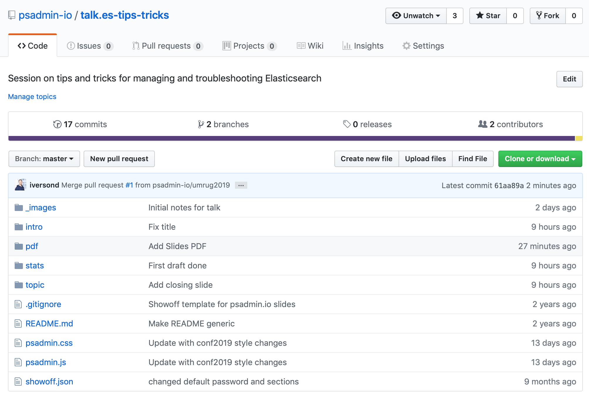

!SLIDE bullets incremental

# ACM

* Automated Configuration Management
* Database Configuration
* Leverages SQL **and** PeopleCode
* Search Framework Plugins
* Configure **and** Deploy Search Indexes

!SLIDE bullets

# ACM Demo

1. Configure ES Cluster
1. Clear previous ES Deployment Data
1. Redeploy ALL indexes

!SLIDE supplemental guide

# ACM and Search Framework Demo

1. Use the `SEARCH_TEMPLATE` ACM plugin
1. Configure a 3 node cluster (pre-configured)
1. Remove previously deployed PTSF data

    This removes it from the PSTF* tables, but not Elasticsearch

1. Deploy ALL indexes and start a full build for each
1. Show the run controls for the builds (full and incr)

!SLIDE bullets incremental

# Elasticsearch Management

* Elasticsearch is API-based
* "Interact" link in Search Framework
* Cerebro and ElasticHQ offer GUI management (open source)

~~~SECTION:notes~~~
Elasticsearch Interact is a quick tool for somethings, but it's very strucutred. You can't change what data you are looking for; you can only use the pre-built functions. That's good when you are starting - it shows the basic data you need to understand.
~~~ENDSECTION~~~

!SLIDE bullets

# Cerebro Demo

1. Show shard allocation
1. View replica status
1. Update index settings
1. Yellow/Green/Red status

!SLIDE supplemental guide

# Cerebro Demo

1. [Access Cerebro URL](http://ec2-3-82-138-233.compute-1.amazonaws.com:9000/)
1. Start Overview of features
  1. Show shard allocation
  1. Update index settings
  1. Yellow/Green/Red status

!SLIDE bullets incremental

# Replicas

* Copies of Elasticsearch data
* Required for High Availability in a cluster
* 2x storage for 1 replica
* Configured globally and per-index

!SLIDE bullets

# Replicas Demo

1. Use Cerebro to set replicas
1. Set replicas per-index
1. Set replicas globally

!SLIDE supplemental guide

# Replicas Demo

1. Cerebro Set Replica 
1. Deploy Index Page (need to undeploy/override)
1. Search Options Page 
  
    Set the global replicas to 1 and redeploy all indexes for next demo

1. `orcl_es_acl` - takes the highest replica setting - do not manage directly

!SLIDE bullets incremental

# Shard Movement

* Shards are like database partitions
* Elasticsearch manages the placement of shards in a cluster
* Replica shards are used for failover/HA

!SLIDE bullets

# Shard Movement Demo

1. Watch Elasticsearch balance shards during an HA event

!SLIDE supplemental guide

# Shard Movement Demo

1. Stop ES on a node
1. Watch shard movement in Cerebro

    ES will rebalance shards if a node goes down - required replicas already set so data has a copy on available nodes

!SLIDE bullets incremental

# Capture Search Requests

* No delivered HTTP log of search
  * Paid feature to log HTTP requests with X-Pack
  * X-Pack not supported with PS Elasticsearch
* Capture a single user's requests
* Use a proxy (like `mitmproxy`) to capture requests
* Capture "slow" searches
  * Configured per-index

!SLIDE bullets

# Capture Search Requests Demo

1. Track Searches for a single user
1. Start `mitmproxy` to view requests
1. Introduce the Kibana Dev Console

!SLIDE supplemental guide

# Capture Search Requests Demo

1. In the Search Options page, add `PS` to the "Log ES requests for User ID" field
1. Run a search and view the trace file on the app server
1. Start `mitmproxy`

        @@@bash
        mitmproxy --listen-port 9200 --mode reverse:http://ec2-34-203-252-37.compute-1.amazonaws.com:9200

1. Configure the Search Instance to use `localhost:9200`
1. Test a few searches 
1. In the Dev Console (in Kibana), configure the "slowlog" settings

        @@@json
        PUT /ptportalregistry_psftdb/_settings
        {"index.indexing.slowlog.threshold.index.debug": "0s",
        "index.search.slowlog.threshold.fetch.debug" : "0s",
        "index.search.slowlog.threshold.query.debug": "0s"}

1. View the search results in the `ESCLUSTER_index_search_slowlog.log`

!SLIDE bullets incremental

# Understanding Callback Security

* Elasticsearch query finds all rows
* Need to filter data based on PeopleSoft security
* PeopleSoft provides a filter attribute
* Elasticsearch calls back to PS for filter attribute
* Each document in Elasticsearch has filter values
* Elasticsearch filters documents before returning results

!SLIDE bullets

# Filter Values

* `ptportalregistry`

        @@@json
        "PORTAL_SECTYPE_ORCL_ES_ACL" : [
          "1:PTDMO",
          "P:PTPT1200",
          "S:Admin"
        ]

!SLIDE bullets

# Callback URL

* `IB RESTListener URL`/`getsecurityvalues.v1`
  * `?type=`Search Definition
  * `?user=`User ID
  * `?attribute=`Filter Attribute

!SLIDE bullets

# Callback Security Demo

1. View documents in Elasticsearch
1. Test Callback Response

!SLIDE supplemental guide

# Callback Security Demo

1. View documents raw in Elasticsearch

        @@@bash
        curl -u esadmin:Passw0rd! http://localhost:9200/ptportalregistry_psftdb/_search?pretty=true -H 'Content-Type: application/json; encoding="UTF-8"' -H 'SearchUser: PS' | jq

1. View callback filter

        @@@bash
        curl -u PS:PS http://ec2-3-82-138-233.compute-1.amazonaws.com:8000/PSIGW/RESTListeningConnector/PSFT_HR/getsecurityvalues.v1/?type=ptportalregistry_psftdb?user=PS?attribute=PORTAL_SECTYPE_ORCL_ES_ACL | jq

!SLIDE bullets incremental

# Cached Security

* Callback process is expensive
* Cache user security in Elasticsearch
* Default is 120 minutes
* Configurable in Search Options

!SLIDE bullets

# Cached Security Demo

1. Query the `orcl_es_acl` index

!SLIDE supplemental guide

# Cached Security Demo

1. Use `curl` to query the `orcl_es_acl` index

        @@@bash
        curl -u esadmin:Passw0rd! http://ec2-34-239-103-132.compute-1.amazonaws.com:9200/orcl_es_acl/_search?pretty=true&size=50

!SLIDE bullets incremental

# Full Build Tuning

* Connected Query SQL tuning
* Use Direct Transfer
* Elasticsearch Replicas
* Elasticsearch Refresh Interval

!SLIDE bullets

# Full Build Tuning Demo

1. Verify Direct Transfer is enabled
1. Change Refresh Interval setting
1. Reduce Replicas

!SLIDE supplemental guide

# Full Build Tuning Demo

1. Under PT > Search Framework > Admin > Search Options
1. Ensure DirectTransfer is set to `Y`
1. In Cerebro, adjust the `replicas` and `refresh interval` settings for an index
1. In Kibana, use the Dev Tools for the same settings

        @@@json
        PUT /pt_portalregistry_psftdb/_settings
        {
            "index" : {
                "number_of_replicas" : 0,
                "refresh_interval" : "-1"
            }
        }

1. After the Full Build

        @@@json
        PUT /pt_portalregistry_psftdb/_settings
        {
            "index" : {
                "number_of_replicas" : 1,
                "refresh_interval" : "30s"
            }
        }

> [flush and refresh operations in Elasticsearch](https://qbox.io/blog/refresh-flush-operations-elasticsearch-guide)

!SLIDE bullets incremental

# Limiting Search Data

* Control non-production datasets
* Not all indexes need all data
* Only affects the initial full build

!SLIDE bullets

# Limiting Search Data Demo

1. Adjust "Last X Days" for a Search Defintion

!SLIDE supplemental guide

# Limiting Search Data Demo

1. Under PT > Search Framework > Designer > Search Defn
1. Open a Search Defn > Advanced tab
1. Set to 120 days
1. Run a full build for that index - notice the date criteria

!SLIDE white bullets

# Community

* Slack
* Wiki
* GitHub

https://psadmin.io

!SLIDE bullets

# Presentation Slides and Guide

https://github.com/psadmin-io/talk.es-tips-tricks

